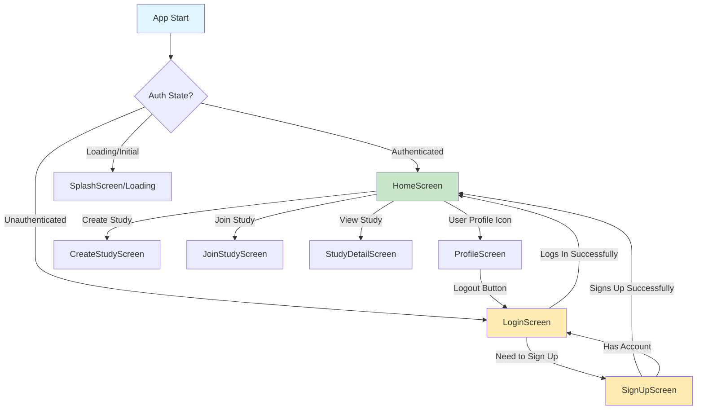
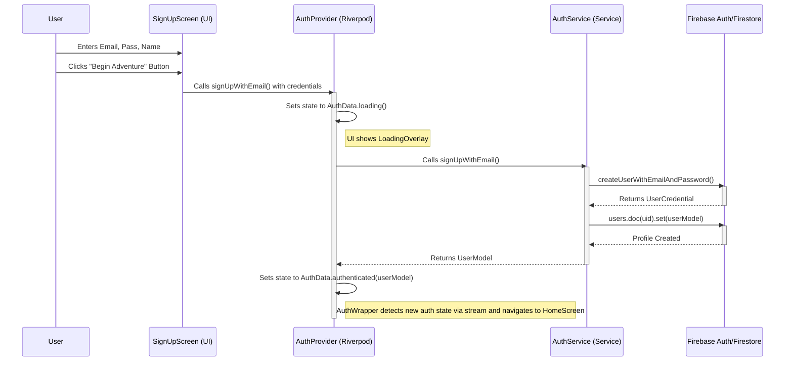
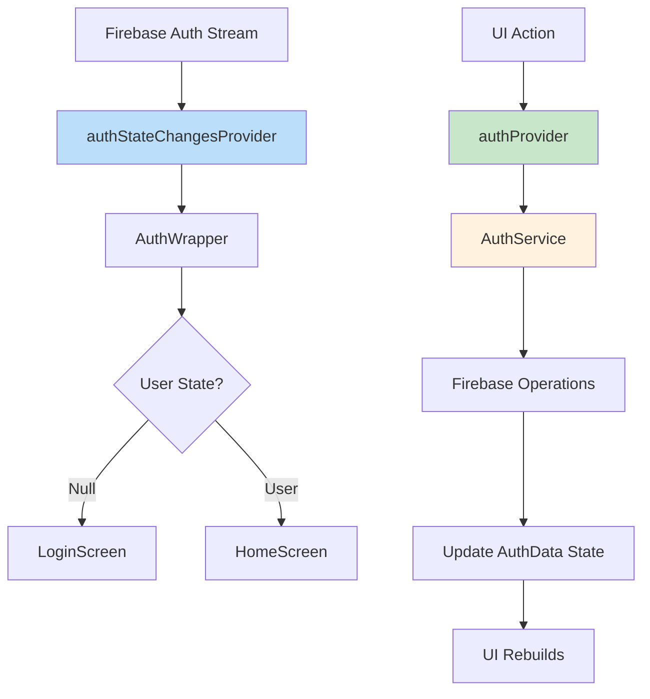
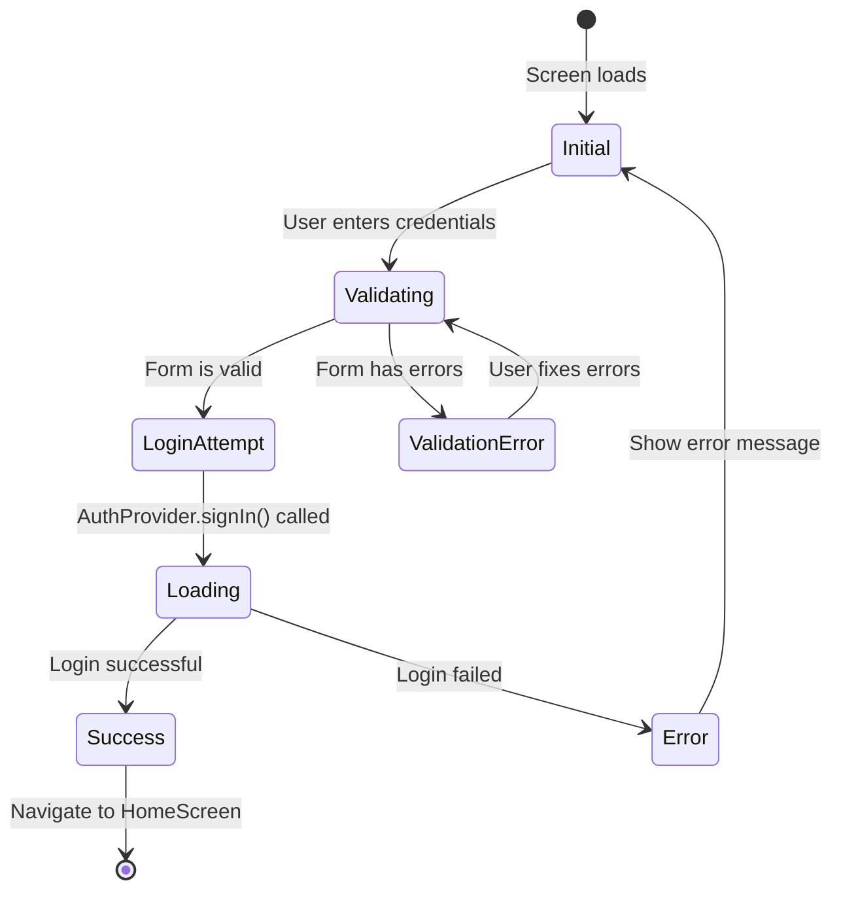
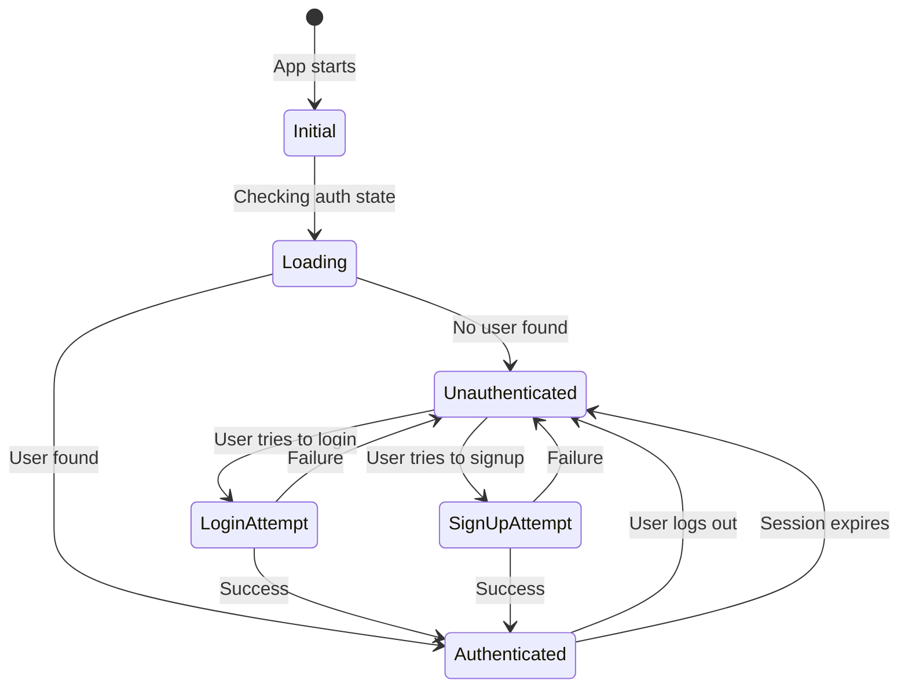
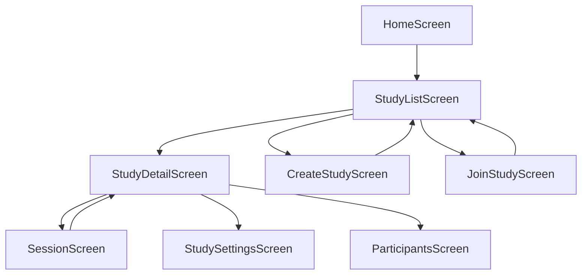
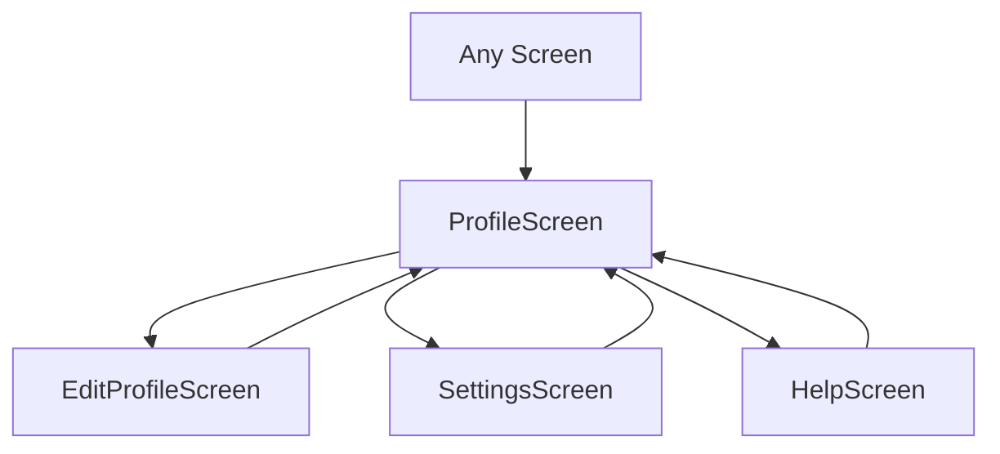
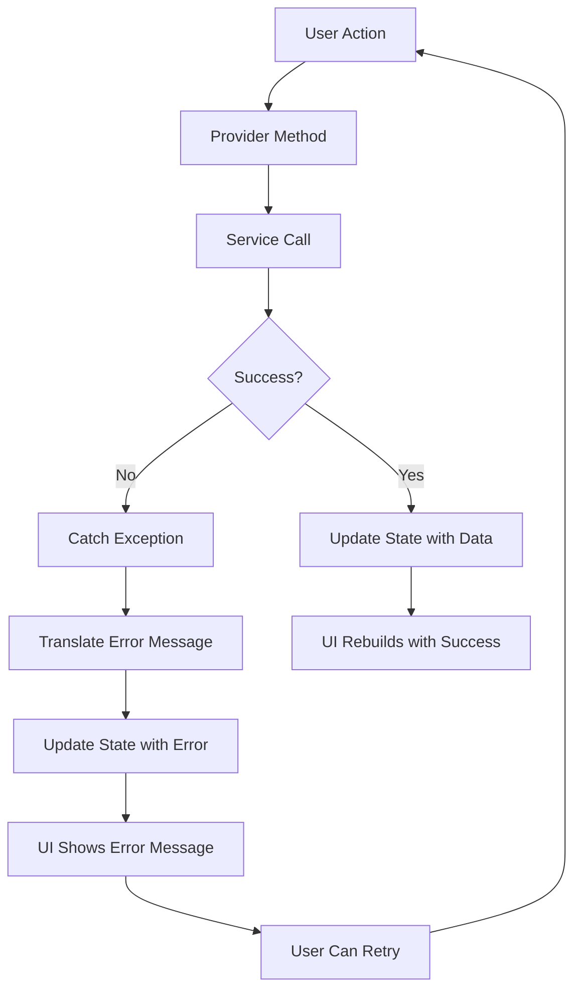

# Project Atlas: Application Flow Documentation

**Generated**: June 14, 2025  
**Purpose**: To provide a single source of truth for the primary navigation and data flows within the application.

---

## 🗺️ **1. Navigation Flow**

This flow describes the user's journey through the app's screens.

### **Key Navigation Components:**

- **`AuthWrapper.dart`**: The central gatekeeper. It listens to the `authStateChangesProvider` and directs the user to either the `LoginScreen` or `HomeScreen`. It is the only component that should perform this top-level routing.
- **`LoginScreen.dart`**: Navigates to `SignUpScreen`.
- **`SignUpScreen.dart`**: Navigates back to `LoginScreen`.
- **`ProfileScreen.dart`** (Future): Will contain the logout button, which triggers the `authProvider.signOut()` method, causing the `AuthWrapper` to automatically redirect to the `LoginScreen`.

---

## 💾 **2. Data Flow: User Authentication**

This flow describes how data moves from user input to the UI during the sign-up process.

### **Data Flow Principles:**

1. **UI to Provider**: The UI layer (Screens/Widgets) only calls methods on the Riverpod Notifiers (`AuthProvider`). It never interacts directly with services.
2. **Provider to Service**: The Provider layer (`AuthProvider`) contains the business logic. It orchestrates calls to one or more services (`AuthService`).
3. **Service to External API**: The Service layer (`AuthService`) is the only layer that communicates with external resources (Firebase). It handles the direct API calls, data transformation, and error translation.
4. **Data Flows Up, State Flows Down**: Services return raw data models (`UserModel`). Providers wrap this data in a state object (`AuthData`). The UI consumes this state and rebuilds accordingly.

---

## 🔄 **3. State Management Flow**

This diagram shows how state flows through the Riverpod providers.

### **Provider Responsibilities:**

- **`authStateChangesProvider`** (StreamProvider): 
  - **Purpose**: Real-time authentication state for navigation
  - **Usage**: ONLY in `AuthWrapper` for automatic routing
  - **Data**: Raw `User?` from Firebase Auth stream

- **`authProvider`** (StateNotifierProvider):
  - **Purpose**: UI state management and user actions  
  - **Usage**: In auth screens for login/signup actions and loading states
  - **Data**: Rich `AuthData` state with loading/error information

---

## 📱 **4. Screen-Level Data Flow**

### **Login Screen Flow**

### **Data Dependencies:**

| Screen | Watches | Calls | Navigates To |
|---|---|---|---|
| `AuthWrapper` | `authStateChangesProvider` | None | `LoginScreen` or `HomeScreen` |
| `LoginScreen` | `authProvider` | `authProvider.signIn()` | `SignUpScreen` |
| `SignUpScreen` | `authProvider` | `authProvider.signUp()` | `LoginScreen` |
| `HomeScreen` | `authProvider` | `authProvider.signOut()` | None (handled by AuthWrapper) |

---

## 🔐 **5. Authentication State Transitions**

---

## 🚀 **6. Future Navigation Flows**

### **Study Management (Planned)**

### **User Profile (Planned)**

---

## 📋 **7. Error Handling Flow**

### **Error Handling Principles:**

1. **Service Layer**: Catches raw exceptions and translates them to user-friendly messages
2. **Provider Layer**: Wraps errors in state objects (`AuthData.error(message)`)
3. **UI Layer**: Displays error messages and provides retry mechanisms
4. **Consistency**: All Firebase errors use the same translation utility

---

## 🎯 **8. Performance Considerations**

### **State Optimization:**

- **Stream Providers**: Only used for real-time data that needs immediate updates
- **State Notifiers**: Used for complex state with user actions
- **Consumer Widgets**: Placed as low as possible in the widget tree to minimize rebuilds
- **Selectors**: Used when only specific parts of state are needed

### **Navigation Optimization:**

- **Lazy Loading**: Screens are only built when navigated to
- **State Preservation**: User input is preserved during navigation (form data, scroll positions)
- **Memory Management**: Unused screens are disposed of properly

---

## ✅ **9. Flow Validation Checklist**

- [ ] **Authentication**: User can sign up, log in, and log out
- [ ] **Navigation**: All screens are reachable and navigable
- [ ] **State Management**: State updates trigger appropriate UI changes
- [ ] **Error Handling**: All error states are handled gracefully
- [ ] **Loading States**: Users see feedback during async operations
- [ ] **Data Persistence**: User state persists across app restarts
- [ ] **Navigation Guards**: Unauthenticated users cannot access protected screens

This comprehensive flow documentation serves as the single source of truth for understanding how data and navigation work throughout the Project Atlas application.
