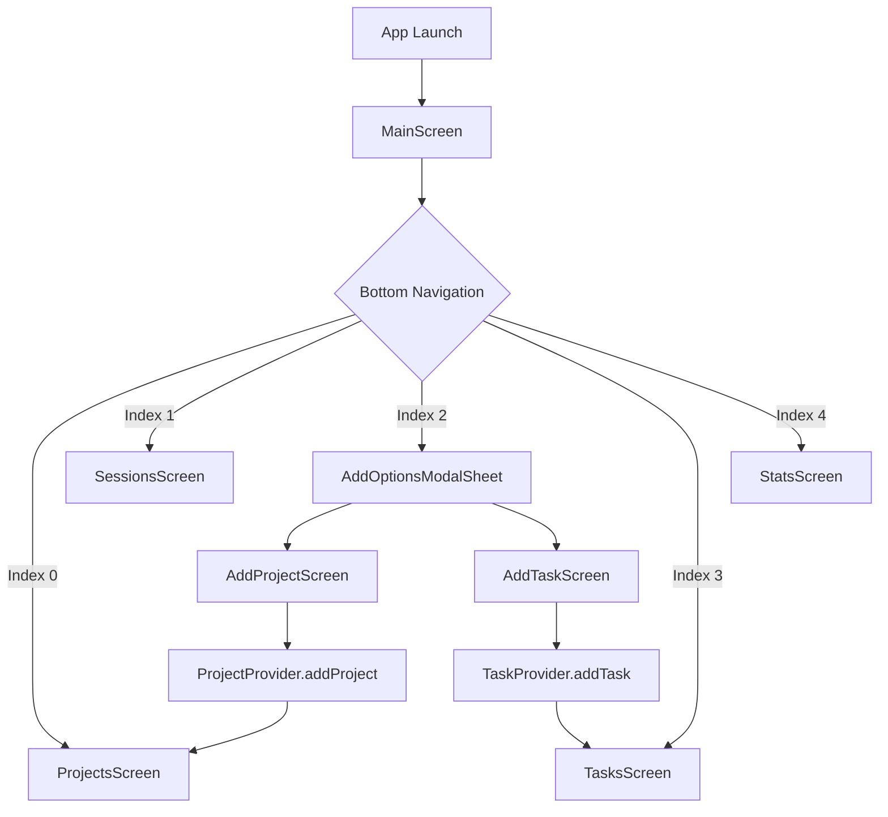

# Architecture Documentation 🏗️

Comprehensive architectural overview of the Study Tracker Mobile Flutter application.

## 📋 Table of Contents

- [Architectural Overview](#-architectural-overview)
- [Design Patterns](#-design-patterns)
- [Project Structure](#-project-structure)
- [State Management](#-state-management)
- [Data Layer](#-data-layer)
- [UI Layer](#-ui-layer)
- [Navigation Flow](#-navigation-flow)
- [Dependency Graph](#-dependency-graph)

---

## 🎯 Architectural Overview

The Study Tracker Mobile application follows a **Feature-First Architecture** combined with **Clean Architecture** principles, ensuring scalability, maintainability, and testability.

### Core Principles

1. **Separation of Concerns**: Each layer has a single responsibility
2. **Dependency Inversion**: High-level modules don't depend on low-level modules
3. **Feature-Based Organization**: Code organized by business features
4. **Reactive State Management**: UI reacts to state changes automatically

### Architecture Layers


---

## 🛠️ Design Patterns

### 1. Feature-First Architecture

**Structure**: Code is organized by features rather than by technical layers.

```
features/
├── projects/         # Project management feature
│   ├── screens/      # UI screens
│   ├── widgets/      # Reusable widgets
│   └── providers/    # State management
├── tasks/           # Task management feature
├── timer/           # Timer functionality
├── sessions/        # Session tracking
└── core_ui/         # Shared UI components
```

**Benefits**:
- Easy to locate feature-related code
- Promotes code reusability within features
- Facilitates team collaboration
- Simplifies testing and maintenance

### 2. Provider Pattern (State Management)

**Implementation**: Using the `provider` package for reactive state management.

```dart
// Provider registration in main.dart
MultiProvider(
  providers: [
    ChangeNotifierProvider(create: (_) => ProjectProvider()),
    ChangeNotifierProvider(create: (_) => TaskProvider()),
    ChangeNotifierProvider(create: (_) => TimerServiceProvider()),
    ChangeNotifierProvider(create: (_) => SessionProvider()),
  ],
  child: const AppRoot(),
)
```

**Benefits**:
- Automatic UI updates on state changes
- Type-safe state access
- Excellent performance with selective rebuilds
- Easy testing and mocking

### 3. Repository Pattern

**Implementation**: `DatabaseHelper` serves as a repository for all data operations.

```dart
class DatabaseHelper {
  static final DatabaseHelper instance = DatabaseHelper._init();
  
  Future<void> insertProject(Project project) async { }
  Future<List<Project>> getAllProjects() async { }
  Future<void> updateProject(Project project) async { }
}
```

**Benefits**:
- Abstraction of data access logic
- Easy to swap data sources
- Centralized data operations
- Simplified testing with mock repositories

### 4. Singleton Pattern

**Implementation**: Database instance management.

```dart
class DatabaseHelper {
  static final DatabaseHelper instance = DatabaseHelper._init();
  static Database? _database;
  
  DatabaseHelper._init();
  
  Future<Database> get database async {
    if (_database != null) return _database!;
    _database = await _initDatabase();
    return _database!;
  }
}
```

**Benefits**:
- Single database connection
- Resource efficiency
- Thread-safe operations
- Consistent state across the app

---

## 📁 Project Structure

### Detailed Breakdown

```
lib/
├── main.dart                           # Application entry point
└── src/
    ├── app.dart                        # Root widget configuration
    ├── constants/                      # Application constants
    │   ├── app_colors.dart            # Color palette
    │   └── app_theme.dart             # Theme configuration
    ├── features/                       # Feature modules
    │   ├── core_ui/                   # Core UI components
    │   │   └── screens/
    │   │       └── main_screen.dart   # Main navigation screen
    │   ├── projects/                  # Project management
    │   │   ├── screens/
    │   │   │   ├── projects_screen.dart
    │   │   │   └── add_project_screen.dart
    │   │   ├── widgets/
    │   │   │   ├── project_list_item.dart
    │   │   │   └── date_scroller.dart
    │   │   └── providers/
    │   │       └── project_provider.dart
    │   ├── tasks/                     # Task management
    │   │   ├── screens/
    │   │   │   ├── tasks_screen.dart
    │   │   │   └── add_task_screen.dart
    │   │   ├── widgets/
    │   │   │   └── task_list_item.dart
    │   │   └── providers/
    │   │       └── task_provider.dart
    │   ├── timer/                     # Timer functionality
    │   │   └── providers/
    │   │       └── timer_service_provider.dart
    │   ├── sessions/                  # Session tracking
    │   │   ├── screens/
    │   │   │   └── sessions_screen.dart
    │   │   ├── widgets/
    │   │   │   └── session_list_item.dart
    │   │   └── providers/
    │   │       └── session_provider.dart
    │   ├── stats/                     # Statistics (placeholder)
    │   │   └── screens/
    │   │       └── stats_screen.dart
    │   └── add_item/                  # Add item modal
    │       └── widgets/
    │           └── add_options_modal_sheet.dart
    ├── models/                        # Data models
    │   ├── project_model.dart         # Project entity
    │   ├── task_model.dart           # Task entity
    │   └── session_model.dart        # Session entity
    ├── services/                      # Business services
    │   └── database_helper.dart      # SQLite operations
    └── utils/                         # Utility functions
        └── formatters.dart           # Formatting helpers
```

### File Naming Conventions

- **Screens**: `{feature}_screen.dart`
- **Widgets**: `{widget_name}.dart` (descriptive names)
- **Providers**: `{feature}_provider.dart`
- **Models**: `{entity}_model.dart`
- **Services**: `{service_name}_helper.dart`

---

## 🔄 State Management

### Provider Architecture Flow


### State Management Patterns

#### 1. Local State (StatefulWidget)

Used for:
- Form inputs
- UI-specific state (selected index, etc.)
- Temporary state that doesn't need global access

```dart
class _AddProjectScreenState extends State<AddProjectScreen> {
  final _formKey = GlobalKey<FormState>();
  final TextEditingController _nameController = TextEditingController();
  Color _selectedColor = AppColors.primaryColor;
  DateTime? _selectedDueDate;
}
```

#### 2. Global State (Provider)

Used for:
- Application-wide data
- Business logic state
- Data that multiple screens need access to

```dart
class ProjectProvider extends ChangeNotifier {
  List<Project> _projects = [];
  
  List<Project> get projects => _projects;
  
  Future<void> addProject(Project project) async {
    await DatabaseHelper.instance.insertProject(project);
    await fetchProjects();  // Triggers notifyListeners
  }
}
```

#### 3. Reactive UI Updates

```dart
// Consumer for automatic rebuilds
Consumer<ProjectProvider>(
  builder: (context, provider, _) {
    return ListView.builder(
      itemCount: provider.projects.length,
      itemBuilder: (context, index) => ProjectListItem(
        project: provider.projects[index],
      ),
    );
  },
)

// Provider.of for actions without rebuilds
onPressed: () {
  Provider.of<ProjectProvider>(context, listen: false)
    .addProject(newProject);
}
```

---

## 🗄️ Data Layer

### Database Schema Design


### Data Access Layer

#### 1. Model Layer

```dart
// Immutable data classes with serialization
class Project {
  final String id;
  final String name;
  // ... other properties
  
  // Database serialization
  Map<String, dynamic> toMap() { }
  factory Project.fromMap(Map<String, dynamic> map) { }
}
```

#### 2. Repository Layer

```dart
class DatabaseHelper {
  // CRUD operations abstracted
  Future<void> insertProject(Project project) async { }
  Future<List<Project>> getAllProjects() async { }
  Future<void> updateProject(Project project) async { }
}
```

#### 3. Provider Layer

```dart
class ProjectProvider extends ChangeNotifier {
  // Business logic and state management
  Future<void> addProject(Project project) async {
    await DatabaseHelper.instance.insertProject(project);
    await fetchProjects();
  }
}
```

---

## 🎨 UI Layer

### Component Hierarchy


### Widget Categories

#### 1. Screen Widgets

- **Purpose**: Top-level feature screens
- **Characteristics**: Stateful, manage local UI state
- **Examples**: `ProjectsScreen`, `TasksScreen`, `AddProjectScreen`

#### 2. List Item Widgets

- **Purpose**: Reusable components for displaying data
- **Characteristics**: Stateless, receive data via props
- **Examples**: `ProjectListItem`, `TaskListItem`, `SessionListItem`

#### 3. Utility Widgets

- **Purpose**: Shared UI components
- **Characteristics**: Highly reusable, configurable
- **Examples**: `HorizontalDateScroller`, `AddOptionsModalSheet`

### Theme Architecture

```dart
// Centralized theme configuration
final ThemeData darkTheme = ThemeData(
  brightness: Brightness.dark,
  primaryColor: AppColors.primaryColor,
  scaffoldBackgroundColor: AppColors.backgroundColor,
  // ... comprehensive theme setup
);
```

**Benefits**:
- Consistent styling across the app
- Easy theme customization
- Support for multiple themes
- Automatic Material Design compliance

---

## 🧭 Navigation Flow

### Navigation Architecture



### Navigation Patterns

#### 1. Bottom Navigation

```dart
// IndexedStack preserves state
IndexedStack(
  index: _currentIndex,
  children: _screens,
)
```

**Benefits**:
- State preservation across tabs
- Smooth transitions
- Memory efficient

#### 2. Modal Navigation

```dart
// Modal bottom sheet for contextual actions
showModalBottomSheet(
  context: context,
  isScrollControlled: true,
  backgroundColor: Colors.transparent,
  builder: (context) => const AddOptionsModalSheet(),
);
```

#### 3. Standard Navigation

```dart
// Push navigation for forms
Navigator.of(context).push(
  MaterialPageRoute(builder: (_) => const AddProjectScreen()),
);
```

---

## 📊 Dependency Graph

### Provider Dependencies


### External Dependencies

1. **Core Flutter**: Framework foundation
2. **Provider**: State management
3. **SQLite**: Local database
4. **UUID**: Unique ID generation
5. **Intl**: Date/time formatting
6. **Path Provider**: File system access

### Dependency Injection

```dart
// Manual dependency injection via MultiProvider
MultiProvider(
  providers: [
    ChangeNotifierProvider(create: (_) => ProjectProvider()),
    ChangeNotifierProvider(create: (_) => TaskProvider()),
    ChangeNotifierProvider(create: (_) => TimerServiceProvider()),
    ChangeNotifierProvider(create: (_) => SessionProvider()),
  ],
  child: const AppRoot(),
)
```

---

## 🔒 Architecture Benefits

### Scalability

- **Feature isolation**: New features can be added without affecting existing code
- **Modular structure**: Components can be developed and tested independently
- **Clear boundaries**: Well-defined interfaces between layers

### Maintainability

- **Single responsibility**: Each class has one reason to change
- **Loose coupling**: Components depend on abstractions, not concretions
- **Consistent patterns**: Developers can quickly understand and modify code

### Testability

- **Dependency injection**: Easy to mock dependencies
- **Pure functions**: Utility functions are easy to test
- **State isolation**: Business logic separated from UI logic

### Performance

- **Selective rebuilds**: Provider pattern ensures only necessary widgets rebuild
- **State preservation**: IndexedStack maintains widget state across navigation
- **Efficient database operations**: Singleton pattern prevents multiple connections

---

## 🚀 Future Architecture Considerations

### Potential Improvements

1. **Repository Abstraction**: Create abstract repository interfaces for better testing
2. **Use Cases Layer**: Add business logic layer between UI and data
3. **Dependency Injection Container**: Use GetIt or similar for more sophisticated DI
4. **Event-Driven Architecture**: Implement event bus for loose coupling
5. **State Management Evolution**: Consider Riverpod or Bloc for complex state scenarios

### Migration Strategies

1. **Gradual Migration**: Introduce new patterns incrementally
2. **Feature Flags**: Use feature toggles during architectural changes
3. **Backward Compatibility**: Maintain existing APIs during transitions
4. **Comprehensive Testing**: Ensure test coverage before major changes

This architecture provides a solid foundation for the Study Tracker Mobile application while maintaining flexibility for future growth and improvements.
