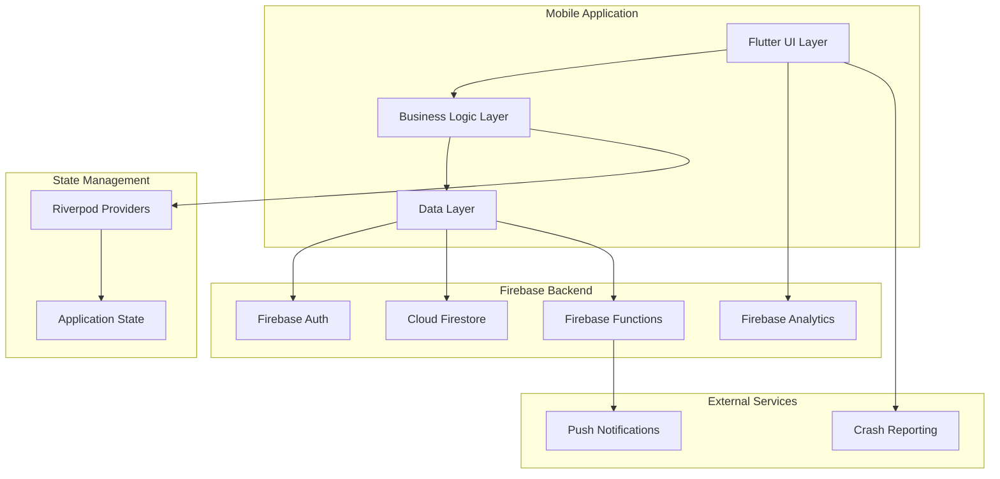
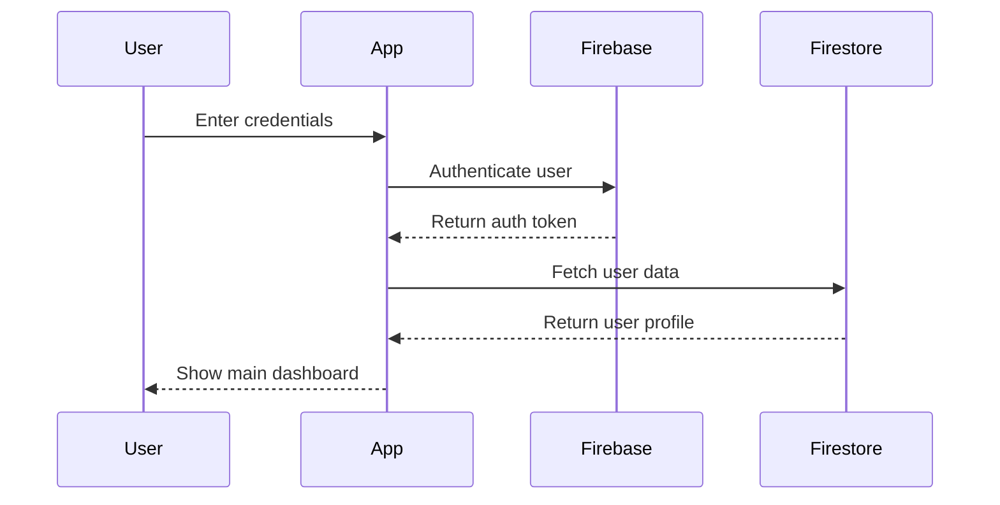
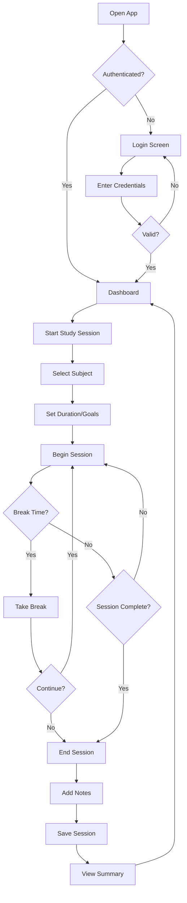
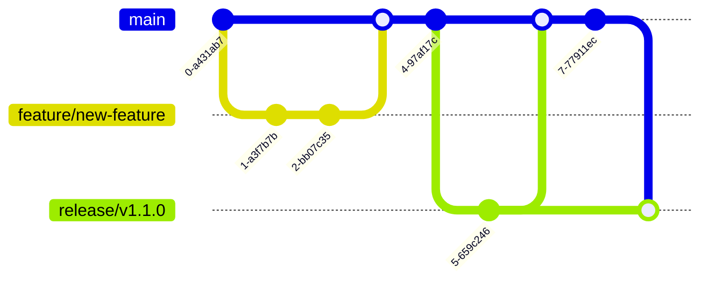

# Project Atlas - Complete Project Specification

## Executive Summary

Project Atlas is a comprehensive study tracking mobile application built with Flutter and Firebase, designed to help students monitor, analyze, and optimize their study habits. The application provides real-time study session tracking, detailed analytics, goal setting, and progress visualization to enhance learning effectiveness.

### Vision Statement
"Empowering students to achieve academic excellence through intelligent study tracking and data-driven insights."

### Mission Statement
"To provide students with a comprehensive, intuitive, and evidence-based platform for tracking, analyzing, and optimizing their study habits to maximize learning outcomes."

## Project Overview

### Current Status
- **Development Phase**: Alpha/Early Development
- **Version**: 0.1.0
- **Platform**: Mobile (Android/iOS)
- **Technology Stack**: Flutter 3.24+, Firebase, Dart
- **Team Size**: 1-2 developers
- **Timeline**: 6-month initial development cycle

### Key Success Metrics
- **User Engagement**: 80% DAU (Daily Active Users)
- **Study Completion Rate**: 90% of started sessions completed
- **User Retention**: 70% 30-day retention rate
- **Performance**: < 3 second app startup time
- **Quality**: < 0.1% crash rate

## Functional Requirements

### Core Features

#### 1. User Authentication & Management
**Priority**: Critical
**Status**: 60% Complete

**Requirements**:
- Firebase Authentication integration
- Email/password registration and login
- Password reset functionality
- User profile management
- Secure account deletion with confirmation
- Social authentication (Google, Apple) - Future enhancement

**Acceptance Criteria**:
```gherkin
Feature: User Authentication
  Scenario: User Registration
    Given a new user opens the app
    When they complete the registration form with valid information
    Then they should receive a verification email
    And be able to log into the app after verification

  Scenario: User Login
    Given an existing user with valid credentials
    When they enter their email and password
    Then they should be successfully logged in
    And directed to the main dashboard
```

**Current Implementation**:
- Basic email/password authentication ✅
- User registration flow ✅
- Login/logout functionality ✅
- Form validation ✅
- Error handling ⚠️ (Partial)
- Password reset ❌ (Not implemented)

#### 2. Study Session Management
**Priority**: Critical
**Status**: 40% Complete

**Requirements**:
- Start/stop study sessions
- Subject/topic categorization
- Session duration tracking
- Break time management
- Session notes and reflections
- Pomodoro technique integration
- Offline session tracking with sync

**Acceptance Criteria**:
```gherkin
Feature: Study Session Tracking
  Scenario: Start Study Session
    Given a logged-in user
    When they select a subject and start a study session
    Then the timer should begin counting
    And the session should be saved to the database

  Scenario: Complete Study Session
    Given an active study session
    When the user stops the session
    Then the total duration should be calculated
    And session data should be saved with notes
```

**Current Implementation**:
- Basic session start/stop ⚠️ (UI incomplete)
- Subject selection ❌ (Not implemented)
- Duration tracking ⚠️ (Logic exists, UI incomplete)
- Notes functionality ❌ (Not implemented)
- Break management ❌ (Not implemented)

#### 3. Study Analytics & Reporting
**Priority**: High
**Status**: 10% Complete

**Requirements**:
- Daily/weekly/monthly study summaries
- Subject-wise time distribution
- Study streak tracking
- Goal progress monitoring
- Performance trends analysis
- Comparative analytics (week over week)
- Exportable reports (PDF/CSV)

**Current Implementation**:
- Basic data structure ⚠️ (Models defined)
- Analytics calculations ❌ (Not implemented)
- Visualization components ❌ (Not implemented)
- Report generation ❌ (Not implemented)

#### 4. Goal Setting & Progress Tracking
**Priority**: High
**Status**: 0% Complete

**Requirements**:
- SMART goal creation (Specific, Measurable, Achievable, Relevant, Time-bound)
- Daily/weekly study targets
- Subject-specific goals
- Progress visualization
- Achievement badges/rewards
- Goal adjustment and revision
- Notification reminders

**Current Implementation**:
- Goal models ❌ (Not defined)
- Goal creation UI ❌ (Not implemented)
- Progress tracking ❌ (Not implemented)
- Notifications ❌ (Not implemented)

### Secondary Features

#### 5. Study Planning & Scheduling
**Priority**: Medium
**Status**: 0% Complete

**Requirements**:
- Calendar integration
- Study schedule creation
- Time blocking functionality
- Reminder notifications
- Recurring study sessions
- Schedule optimization suggestions

#### 6. Collaborative Features
**Priority**: Low
**Status**: 0% Complete

**Requirements**:
- Study group creation
- Shared study goals
- Leaderboards and challenges
- Study buddy matching
- Group study session tracking

#### 7. Gamification Elements
**Priority**: Medium
**Status**: 0% Complete

**Requirements**:
- Achievement system
- Experience points (XP)
- Study streaks
- Level progression
- Customizable avatars
- Reward redemption system

## Non-Functional Requirements

### Performance Requirements

#### Response Time
- **App Launch**: < 3 seconds cold start
- **Navigation**: < 500ms between screens
- **Data Sync**: < 2 seconds for standard operations
- **Search**: < 1 second for local data queries

#### Scalability
- **Concurrent Users**: Support 1,000+ simultaneous users
- **Data Storage**: Handle 1M+ study sessions per month
- **API Throughput**: 1,000 requests/second
- **Database Performance**: < 100ms query response time

#### Resource Usage
- **Memory**: < 100MB baseline usage
- **Battery**: < 5% drain per hour of active usage
- **Storage**: < 50MB app size, < 100MB local data
- **Network**: < 1MB data usage per hour of normal use

### Security Requirements

#### Data Protection
- End-to-end encryption for sensitive data
- Secure token-based authentication
- GDPR compliance for EU users
- COPPA compliance for users under 13
- Regular security audits and penetration testing

#### Privacy Requirements
- Minimal data collection principle
- Explicit consent for data usage
- User data export/deletion on request
- Anonymous usage analytics only
- No sharing of personal data with third parties

### Accessibility Requirements

#### WCAG 2.1 Compliance
- **Level AA** compliance minimum
- Screen reader compatibility
- High contrast mode support
- Font scaling support (up to 200%)
- Voice navigation support
- Keyboard navigation for external keyboards

#### Inclusive Design
- Multi-language support (English, Spanish, French initially)
- Right-to-left language support
- Color-blind friendly design
- Motor impairment accommodations
- Cognitive load minimization

### Platform Requirements

#### Mobile Platforms
- **Android**: API level 21+ (Android 5.0+)
- **iOS**: iOS 12.0+
- **Flutter**: 3.24+ stable channel
- **Device Types**: Phones and tablets (7-13 inch screens)

#### Backend Requirements
- **Firebase**: Latest stable versions
- **Cloud Firestore**: Primary database
- **Firebase Auth**: Authentication service
- **Firebase Analytics**: Usage tracking
- **Firebase Crashlytics**: Error reporting

## Technical Architecture

### System Architecture



### Data Architecture

#### User Data Model
```dart
class UserModel {
  final String uid;
  final String email;
  final String? displayName;
  final String? photoURL;
  final DateTime createdAt;
  final DateTime lastLoginAt;
  final UserPreferences preferences;
  final StudyStatistics statistics;
}

class UserPreferences {
  final String theme; // 'light', 'dark', 'system'
  final bool notificationsEnabled;
  final List<String> studyReminders;
  final int defaultSessionDuration; // minutes
  final bool pomodoroEnabled;
  final Map<String, dynamic> customSettings;
}
```

#### Study Session Data Model
```dart
class StudySessionModel {
  final String id;
  final String userId;
  final String subject;
  final String? topic;
  final DateTime startTime;
  final DateTime? endTime;
  final Duration? duration;
  final StudyType type;
  final List<StudyBreak> breaks;
  final String? notes;
  final List<String> tags;
  final StudyEnvironment environment;
  final double? focusRating; // 1-5 scale
}

enum StudyType {
  reading,
  practice,
  review,
  exam,
  research,
  discussion,
  general
}

class StudyBreak {
  final DateTime startTime;
  final DateTime endTime;
  final BreakType type;
}

enum BreakType {
  short, // 5-15 minutes
  long, // 15-30 minutes
  meal, // 30+ minutes
  other
}
```

#### Analytics Data Model
```dart
class StudyAnalytics {
  final String userId;
  final DateTime date;
  final Duration totalStudyTime;
  final int sessionCount;
  final Map<String, Duration> timeBySubject;
  final Map<StudyType, int> sessionsByType;
  final double averageFocusRating;
  final int streakDays;
  final List<DailyGoal> goals;
}

class DailyGoal {
  final String id;
  final GoalType type;
  final dynamic target; // Duration, int, etc.
  final dynamic achieved;
  final bool completed;
}
```

### State Management Architecture

#### Riverpod Provider Structure
```dart
// Authentication Providers
final authServiceProvider = Provider<AuthService>((ref) => AuthService());
final authStateProvider = StreamProvider<User?>((ref) {
  return ref.read(authServiceProvider).authStateChanges;
});

// Study Session Providers
final studyServiceProvider = Provider<StudyService>((ref) => StudyService());
final activeSessionProvider = StateNotifierProvider<ActiveSessionNotifier, ActiveSessionState>((ref) {
  return ActiveSessionNotifier(ref.read(studyServiceProvider));
});

// Analytics Providers
final analyticsServiceProvider = Provider<AnalyticsService>((ref) => AnalyticsService());
final studyAnalyticsProvider = FutureProvider.family<StudyAnalytics, DateRange>((ref, dateRange) {
  return ref.read(analyticsServiceProvider).getAnalytics(dateRange);
});

// User Preferences Providers
final userPreferencesProvider = StateNotifierProvider<UserPreferencesNotifier, UserPreferences>((ref) {
  return UserPreferencesNotifier();
});
```

### Security Architecture

#### Authentication Flow


#### Data Security Measures
1. **Encryption at Rest**: All user data encrypted in Firestore
2. **Encryption in Transit**: HTTPS/TLS for all communications
3. **Authentication**: JWT tokens with refresh mechanism
4. **Authorization**: Role-based access control
5. **Input Validation**: Client and server-side validation
6. **SQL Injection Prevention**: Parameterized queries only

## User Interface Design

### Design Principles

#### Material Design 3
- **Dynamic Color**: Adaptive color schemes based on user preferences
- **Typography**: Roboto font family with proper hierarchy
- **Components**: Material 3 component library
- **Motion**: Meaningful transitions and animations
- **Accessibility**: Built-in accessibility features

#### User Experience Goals
1. **Simplicity**: Minimize cognitive load
2. **Consistency**: Uniform interaction patterns
3. **Feedback**: Clear system status indication
4. **Error Prevention**: Validate input and provide guidance
5. **Efficiency**: Quick access to common tasks

### Screen Hierarchy

```
Project Atlas App
├── Authentication Flow
│   ├── Welcome/Onboarding
│   ├── Login
│   ├── Register
│   └── Password Reset
├── Main Navigation
│   ├── Dashboard/Home
│   ├── Study Session
│   │   ├── Session Setup
│   │   ├── Active Session
│   │   └── Session Summary
│   ├── Analytics
│   │   ├── Overview
│   │   ├── Subject Analysis
│   │   └── Goal Progress
│   ├── Goals & Planning
│   │   ├── Goal Setting
│   │   ├── Study Planner
│   │   └── Calendar View
│   └── Profile
│       ├── User Settings
│       ├── Preferences
│       └── Data Export
└── Secondary Screens
    ├── Subject Management
    ├── Study History
    ├── Achievement Gallery
    └── Help & Support
```

### User Flow Diagrams

#### Primary User Flow: Study Session


## API Specifications

### Firebase Integration APIs

#### Authentication API
```typescript
interface AuthAPI {
  // User registration
  registerWithEmail(email: string, password: string): Promise<UserCredential>;
  
  // User login
  signInWithEmail(email: string, password: string): Promise<UserCredential>;
  
  // Social authentication
  signInWithGoogle(): Promise<UserCredential>;
  signInWithApple(): Promise<UserCredential>;
  
  // Password management
  resetPassword(email: string): Promise<void>;
  updatePassword(newPassword: string): Promise<void>;
  
  // Session management
  signOut(): Promise<void>;
  getCurrentUser(): User | null;
  onAuthStateChanged(callback: (user: User | null) => void): () => void;
}
```

#### Firestore Data API
```typescript
interface StudySessionAPI {
  // Create new session
  createSession(session: StudySessionData): Promise<string>;
  
  // Update existing session
  updateSession(sessionId: string, updates: Partial<StudySessionData>): Promise<void>;
  
  // End active session
  endSession(sessionId: string, endData: SessionEndData): Promise<void>;
  
  // Query sessions
  getUserSessions(userId: string, options?: QueryOptions): Promise<StudySession[]>;
  getSessionsByDateRange(userId: string, startDate: Date, endDate: Date): Promise<StudySession[]>;
  getActiveSession(userId: string): Promise<StudySession | null>;
  
  // Analytics
  getStudyStatistics(userId: string, period: AnalyticsPeriod): Promise<StudyStatistics>;
  getSubjectBreakdown(userId: string, period: AnalyticsPeriod): Promise<SubjectStats[]>;
}
```

### Local Storage API
```typescript
interface LocalStorageAPI {
  // User preferences
  savePreferences(preferences: UserPreferences): Promise<void>;
  getPreferences(): Promise<UserPreferences>;
  
  // Offline session data
  saveOfflineSession(session: OfflineSession): Promise<void>;
  getOfflineSessions(): Promise<OfflineSession[]>;
  syncOfflineSessions(): Promise<void>;
  
  // Cache management
  clearCache(): Promise<void>;
  getCacheSize(): Promise<number>;
}
```

## Testing Strategy

### Testing Pyramid

#### Unit Tests (70% coverage target)
- **Business Logic**: Study session calculations, analytics
- **Data Models**: Serialization/deserialization
- **Utility Functions**: Date formatting, validation
- **Providers**: State management logic

```dart
// Example unit test
void main() {
  group('StudySession', () {
    test('calculates duration correctly', () {
      final session = StudySession(
        startTime: DateTime(2024, 1, 1, 10, 0),
        endTime: DateTime(2024, 1, 1, 12, 30),
      );
      
      expect(session.duration, equals(Duration(hours: 2, minutes: 30)));
    });
  });
}
```

#### Widget Tests (20% coverage target)
- **Custom Widgets**: AuthButton, CustomTextField
- **Screen Components**: Login form, session timer
- **Navigation**: Route transitions
- **User Interactions**: Tap, scroll, input

```dart
// Example widget test
void main() {
  testWidgets('AuthButton shows loading indicator', (tester) async {
    await tester.pumpWidget(
      MaterialApp(
        home: AuthButton(
          text: 'Login',
          isLoading: true,
          onPressed: () {},
        ),
      ),
    );
    
    expect(find.byType(CircularProgressIndicator), findsOneWidget);
    expect(find.text('Login'), findsNothing);
  });
}
```

#### Integration Tests (10% coverage target)
- **End-to-End Flows**: Complete user journeys
- **Firebase Integration**: Auth and database operations
- **Performance**: App startup and navigation
- **Offline Functionality**: Data persistence and sync

### Test Data Management
```dart
class TestDataManager {
  static UserModel createTestUser() {
    return UserModel(
      uid: 'test_user_123',
      email: 'test@example.com',
      displayName: 'Test User',
      createdAt: DateTime.now(),
      lastLoginAt: DateTime.now(),
    );
  }
  
  static StudySession createTestSession() {
    return StudySession(
      id: 'test_session_123',
      userId: 'test_user_123',
      subject: 'Mathematics',
      startTime: DateTime.now().subtract(Duration(hours: 1)),
      endTime: DateTime.now(),
      type: StudyType.practice,
    );
  }
}
```

## Deployment Strategy

### Environment Configuration

#### Development Environment
- **Purpose**: Local development and testing
- **Firebase Project**: project-atlas-dev
- **Features**: Debug logging, test data, hot reload
- **Access**: Development team only

#### Staging Environment
- **Purpose**: Pre-production testing and QA
- **Firebase Project**: project-atlas-staging
- **Features**: Production-like data, limited logging
- **Access**: QA team and stakeholders

#### Production Environment
- **Purpose**: Live user application
- **Firebase Project**: project-atlas-prod
- **Features**: Optimized performance, minimal logging
- **Access**: End users only

### Release Process

#### Development Workflow


#### CI/CD Pipeline
1. **Code Commit**: Developer pushes to feature branch
2. **Automated Testing**: Unit and widget tests run
3. **Code Review**: Peer review and approval
4. **Merge to Main**: Automated integration tests
5. **Build Generation**: Platform-specific builds
6. **Staging Deployment**: Automatic deployment to staging
7. **QA Approval**: Manual testing and sign-off
8. **Production Release**: Staged rollout to users

### Monitoring and Analytics

#### Performance Monitoring
- Firebase Performance Monitoring
- Custom metrics for study session operations
- Memory and CPU usage tracking
- Network performance analysis

#### User Analytics
- Firebase Analytics for user behavior
- Custom events for study tracking
- Conversion funnel analysis
- Retention and engagement metrics

#### Error Monitoring
- Firebase Crashlytics for crash reporting
- Custom error logging for business logic
- Performance issue tracking
- User feedback collection

## Maintenance and Support

### Maintenance Schedule

#### Daily
- Monitor crash reports and errors
- Review user feedback and ratings
- Check system performance metrics
- Respond to critical issues

#### Weekly
- Code quality review and refactoring
- Dependency updates (patch versions)
- Performance optimization
- User support response

#### Monthly
- Comprehensive testing cycle
- Security audit and updates
- Feature usage analysis
- Technical debt assessment

#### Quarterly
- Major dependency updates
- Architecture review and improvements
- User research and feedback analysis
- Platform compliance updates

### Support Strategy

#### User Support Channels
1. **In-App Help**: Built-in help system and FAQs
2. **Email Support**: Direct email for technical issues
3. **Community Forum**: User-to-user support platform
4. **Knowledge Base**: Comprehensive documentation

#### Issue Priority Matrix
- **P0 (Critical)**: App crashes, data loss, security issues
- **P1 (High)**: Major feature broken, authentication issues
- **P2 (Medium)**: Minor feature issues, UI problems
- **P3 (Low)**: Enhancement requests, cosmetic issues

### Success Criteria

#### Launch Success Metrics
- **Downloads**: 1,000+ in first month
- **Active Users**: 500+ DAU within 3 months
- **Retention**: 60%+ 7-day retention rate
- **Rating**: 4.0+ stars on app stores
- **Performance**: <3 second app startup time

#### Long-term Success Metrics
- **User Growth**: 50%+ month-over-month growth
- **Engagement**: 30+ minutes average session time
- **Study Completion**: 85%+ session completion rate
- **User Satisfaction**: 4.5+ star rating
- **Revenue** (if applicable): Break-even within 12 months

## Risk Management

### Technical Risks

#### High-Risk Areas
1. **Firebase Limitations**: Quota limits and pricing changes
2. **Platform Updates**: Flutter/Android/iOS breaking changes
3. **Performance Issues**: Memory leaks and slow operations
4. **Data Loss**: Synchronization failures
5. **Security Vulnerabilities**: Authentication and data breaches

#### Mitigation Strategies
- Regular backup and disaster recovery procedures
- Multi-platform testing and validation
- Performance monitoring and optimization
- Incremental feature rollouts with rollback plans
- Security audits and penetration testing

### Business Risks

#### Market Risks
- **Competition**: New study tracking apps
- **User Adoption**: Slow initial growth
- **Platform Policies**: App store rejection or removal
- **Technology Obsolescence**: Framework deprecation

#### Mitigation Strategies
- Continuous market research and competitive analysis
- User feedback integration and rapid iteration
- Compliance with platform guidelines
- Technology stack evaluation and migration planning

This comprehensive project specification provides a complete roadmap for the Project Atlas study tracking mobile application, covering all aspects from technical implementation to business strategy and risk management.
