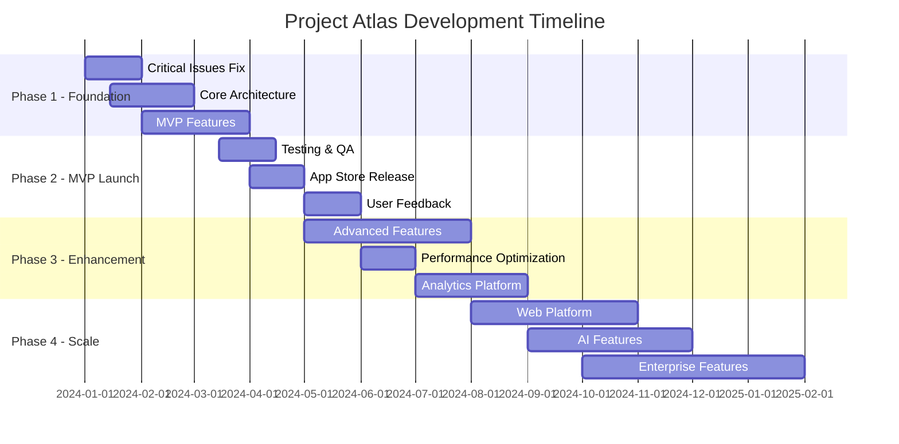

# Development Roadmap

## Project Atlas Development Roadmap 2024-2025

### Executive Summary

This roadmap outlines the strategic development plan for Project Atlas, a comprehensive study tracking mobile application. The roadmap spans 18 months, focusing on delivering a minimum viable product (MVP) within 6 months, followed by feature expansion and platform scaling.

### Vision & Goals

**Vision**: Become the leading study tracking platform that empowers students to optimize their learning through data-driven insights.

**Strategic Goals**:
- Launch MVP within 6 months with core functionality
- Achieve 10,000+ active users within 12 months
- Expand to web platform within 18 months
- Implement AI-powered study recommendations within 24 months

## Roadmap Overview

### Development Phases



## Phase 1: Foundation (January - March 2024)

### Milestone 1.1: Critical Issues Resolution (Month 1)
**Duration**: 4 weeks
**Priority**: P0
**Team Size**: 1-2 developers

#### Objectives
- Resolve all critical security and functionality issues
- Establish solid foundation for future development
- Implement proper error handling and configuration management

#### Key Deliverables
```markdown
✅ Security Issues Fixed
- Remove hardcoded test credentials
- Implement environment-based configuration
- Add security scanning to CI/CD pipeline

✅ Functionality Issues Resolved
- Complete all incomplete widget implementations
- Fix broken error screens and user flows
- Implement comprehensive error handling

✅ Code Quality Baseline
- Achieve 40% test coverage minimum
- Reduce code complexity to acceptable levels
- Eliminate deprecated API usage
```

#### Success Criteria
- [ ] Zero critical security vulnerabilities
- [ ] All user flows functional end-to-end
- [ ] App doesn't crash under normal usage
- [ ] Development environment fully configured

#### Risks & Mitigation
- **Risk**: Timeline pressure affecting quality
- **Mitigation**: Focus on P0 issues first, defer nice-to-have improvements

### Milestone 1.2: Core Architecture Stabilization (Month 2)
**Duration**: 6 weeks
**Priority**: P1
**Team Size**: 2 developers

#### Objectives
- Establish robust, scalable architecture patterns
- Implement comprehensive state management
- Create reusable component library

#### Key Deliverables
```dart
// State Management Architecture
✅ Riverpod Provider Structure
- Authentication providers
- Study session management
- User preferences management
- Analytics data providers

✅ Data Layer Architecture
- Repository pattern implementation
- Offline data synchronization
- Cache management system
- Error boundary implementation

✅ UI Component Library
- Design system implementation
- Reusable widget collection
- Accessibility compliance
- Responsive design patterns
```

#### Technical Specifications
```yaml
Architecture Components:
  State Management: Riverpod 2.6+
  Navigation: GoRouter 14.0+
  Local Storage: Shared Preferences + Secure Storage
  Network: Dio HTTP Client
  Database: Firebase Firestore
  Authentication: Firebase Auth
  Analytics: Firebase Analytics + Custom Events
```

#### Success Criteria
- [ ] Consistent state management across all features
- [ ] Offline-first data architecture implemented
- [ ] UI components pass accessibility audit
- [ ] Performance benchmarks met (startup < 3s)

### Milestone 1.3: MVP Feature Implementation (Month 3)
**Duration**: 4 weeks
**Priority**: P1
**Team Size**: 2-3 developers

#### Core Features Implementation

##### Authentication System
```dart
// Complete authentication flow
Features:
✅ Email/password registration and login
✅ Password reset functionality
✅ Profile management
✅ Account deletion
⭐ Social authentication (Google)
⭐ Multi-factor authentication
```

##### Study Session Tracking
```dart
// Core study tracking functionality
Features:
✅ Start/stop study sessions
✅ Subject categorization
✅ Duration tracking with breaks
✅ Session notes and ratings
⭐ Pomodoro technique integration
⭐ Offline session tracking
```

##### Basic Analytics
```dart
// Essential analytics and reporting
Features:
✅ Daily/weekly study summaries
✅ Subject-wise time distribution
✅ Basic goal tracking
⭐ Study streak tracking
⭐ Performance trends
```

#### Success Criteria
- [ ] Users can complete full study session workflow
- [ ] Data persists correctly across app restarts
- [ ] Basic analytics provide meaningful insights
- [ ] App works offline with sync when online

## Phase 2: MVP Launch (April - June 2024)

### Milestone 2.1: Testing & Quality Assurance (Month 4)
**Duration**: 4 weeks
**Priority**: P0
**Team Size**: 2 developers + 1 QA

#### Testing Strategy Implementation
```yaml
Testing Coverage Goals:
  Unit Tests: 80% coverage
  Widget Tests: 60% coverage
  Integration Tests: 90% of critical user flows
  Performance Tests: All key metrics
  Accessibility Tests: WCAG 2.1 AA compliance
```

#### Quality Gates
```dart
// Automated quality checks
CI/CD Pipeline:
✅ Automated testing on every commit
✅ Performance benchmarking
✅ Security vulnerability scanning
✅ Accessibility testing
✅ Code quality metrics tracking

Manual Testing:
✅ User acceptance testing
✅ Device compatibility testing
✅ Edge case validation
✅ Stress testing
```

#### Success Criteria
- [ ] 95% test pass rate consistently
- [ ] Performance meets all benchmarks
- [ ] Zero critical bugs in testing
- [ ] Accessibility compliance verified

### Milestone 2.2: App Store Preparation & Release (Month 5)
**Duration**: 4 weeks
**Priority**: P0
**Team Size**: 2 developers + 1 marketing

#### Pre-launch Activities
```markdown
App Store Optimization:
✅ App store listing optimization
✅ Screenshots and promotional materials
✅ Privacy policy and terms of service
✅ App store compliance review

Technical Preparation:
✅ Production environment setup
✅ Monitoring and analytics configuration
✅ Crash reporting implementation
✅ Performance monitoring setup
```

#### Launch Strategy
```yaml
Soft Launch:
  Target: 100 beta users
  Duration: 2 weeks
  Focus: Critical bug identification

Staged Rollout:
  Week 1: 5% of target audience
  Week 2: 25% of target audience
  Week 3: 75% of target audience
  Week 4: 100% rollout
```

#### Success Criteria
- [ ] App approved on both iOS and Android stores
- [ ] Zero critical issues in soft launch
- [ ] User onboarding completion rate > 70%
- [ ] App store rating > 4.0 stars

### Milestone 2.3: Post-Launch Optimization (Month 6)
**Duration**: 4 weeks
**Priority**: P1
**Team Size**: 2 developers + 1 analyst

#### Focus Areas
```markdown
User Experience Optimization:
✅ User feedback analysis and implementation
✅ Onboarding flow optimization
✅ Performance improvements based on real usage
✅ Critical bug fixes and stability improvements

Analytics Implementation:
✅ User behavior tracking
✅ Feature usage analytics
✅ Conversion funnel analysis
✅ Retention metrics tracking
```

#### Key Metrics to Track
```yaml
User Metrics:
  Daily Active Users (DAU): Target 500+
  Weekly Retention: Target 60%+
  Session Duration: Target 15+ minutes
  Study Session Completion: Target 85%+

Technical Metrics:
  Crash Rate: Target < 0.1%
  App Rating: Target > 4.2 stars
  Load Time: Target < 3 seconds
  API Response Time: Target < 500ms
```

## Phase 3: Feature Enhancement (July - September 2024)

### Milestone 3.1: Advanced Study Features (Month 7-8)
**Duration**: 8 weeks
**Priority**: P1
**Team Size**: 3 developers

#### Goal Setting & Planning System
```dart
// Comprehensive goal management
Features:
✅ SMART goal creation
✅ Daily/weekly/monthly targets
✅ Subject-specific goals
✅ Progress visualization
✅ Achievement badges
✅ Goal adjustment recommendations
```

#### Enhanced Analytics Dashboard
```dart
// Advanced analytics and insights
Features:
✅ Detailed performance trends
✅ Comparative analysis (week-over-week)
✅ Study efficiency metrics
✅ Productivity recommendations
✅ Exportable reports (PDF/CSV)
✅ Calendar integration
```

#### Study Planning Tools
```dart
// Study scheduling and organization
Features:
✅ Study schedule creation
✅ Calendar integration
✅ Time blocking functionality
✅ Reminder notifications
✅ Recurring study sessions
✅ Schedule optimization suggestions
```

#### Success Criteria
- [ ] Goal completion rate > 75%
- [ ] Advanced analytics used by > 60% of users
- [ ] Study planning tools improve session consistency by 40%

### Milestone 3.2: Social & Gamification Features (Month 9)
**Duration**: 4 weeks
**Priority**: P2
**Team Size**: 2 developers

#### Gamification System
```dart
// Engagement and motivation features
Features:
✅ Achievement system with badges
✅ Experience points (XP) and levels
✅ Study streak tracking
✅ Daily/weekly challenges
✅ Leaderboards (optional participation)
✅ Customizable study avatars
```

#### Social Features
```dart
// Community and collaboration
Features:
✅ Study buddy matching
✅ Study group creation
✅ Shared goals and challenges
✅ Progress sharing
✅ Study tips and advice sharing
✅ Peer motivation system
```

#### Success Criteria
- [ ] User engagement increases by 50%
- [ ] Average session duration increases by 25%
- [ ] Social feature adoption > 40%

## Phase 4: Platform Expansion (October 2024 - February 2025)

### Milestone 4.1: Web Platform Development (Month 10-12)
**Duration**: 12 weeks
**Priority**: P1
**Team Size**: 3 developers + 1 designer

#### Web Application Architecture
```typescript
// Flutter Web implementation
Technology Stack:
✅ Flutter Web for consistent UI/UX
✅ Responsive design for desktop/tablet
✅ Progressive Web App (PWA) capabilities
✅ Offline functionality with sync
✅ Cross-platform data synchronization
```

#### Web-Specific Features
```dart
// Desktop-optimized functionality
Features:
✅ Keyboard shortcuts and navigation
✅ Multi-window support
✅ Advanced data visualization
✅ Bulk data import/export
✅ Extended analytics dashboard
✅ Study session screenshots/notes
```

#### Success Criteria
- [ ] Feature parity with mobile app
- [ ] Desktop user adoption > 30% of mobile users
- [ ] Cross-platform sync works seamlessly

### Milestone 4.2: AI-Powered Recommendations (Month 11-13)
**Duration**: 12 weeks
**Priority**: P2
**Team Size**: 2 developers + 1 ML engineer

#### AI Features Implementation
```python
# Machine learning capabilities
Features:
✅ Personalized study recommendations
✅ Optimal study time suggestions
✅ Subject difficulty assessment
✅ Learning pattern analysis
✅ Break time optimization
✅ Performance prediction models
```

#### Data Science Pipeline
```yaml
ML Infrastructure:
  Data Collection: User behavior, study patterns
  Model Training: TensorFlow/PyTorch models
  Inference: Real-time recommendations
  A/B Testing: Feature effectiveness
  Privacy: Federated learning approach
```

#### Success Criteria
- [ ] AI recommendations improve study efficiency by 25%
- [ ] User satisfaction with recommendations > 80%
- [ ] Recommendation click-through rate > 60%

### Milestone 4.3: Enterprise Features (Month 14-16)
**Duration**: 12 weeks
**Priority**: P3
**Team Size**: 2 developers + 1 business analyst

#### Educational Institution Features
```dart
// Enterprise and educational features
Features:
✅ Teacher/instructor dashboard
✅ Class and student management
✅ Assignment tracking integration
✅ Institutional analytics
✅ Bulk user management
✅ Custom branding options
```

#### Integration Capabilities
```yaml
Third-party Integrations:
✅ Google Classroom
✅ Canvas LMS
✅ Blackboard
✅ Microsoft Teams Education
✅ Zoom integration
✅ Calendar applications (Google, Outlook)
```

#### Success Criteria
- [ ] 10+ educational institutions using platform
- [ ] Enterprise features generate revenue
- [ ] Institution user retention > 90%

## Phase 5: Advanced Platform (March - August 2025)

### Milestone 5.1: Advanced Analytics & AI (Month 17-18)
**Duration**: 8 weeks
**Priority**: P2

#### Advanced AI Features
```python
Features:
✅ Predictive learning analytics
✅ Personalized curriculum recommendations
✅ Learning style adaptation
✅ Automated study plan generation
✅ Real-time performance coaching
✅ Burnout prevention alerts
```

### Milestone 5.2: Platform Scaling & Optimization (Month 19-20)
**Duration**: 8 weeks
**Priority**: P1

#### Infrastructure Scaling
```yaml
Technical Improvements:
✅ Microservices architecture
✅ Advanced caching strategies
✅ Database optimization
✅ CDN implementation
✅ Auto-scaling infrastructure
✅ Global deployment
```

## Resource Planning

### Team Structure Evolution

#### Phase 1-2 (Months 1-6)
```yaml
Core Team:
  - 1 Senior Flutter Developer (Tech Lead)
  - 1 Junior Flutter Developer
  - 1 UI/UX Designer (Part-time)
  - 1 QA Engineer (Part-time)
  - 1 Product Manager (Part-time)
```

#### Phase 3-4 (Months 7-16)
```yaml
Expanded Team:
  - 1 Senior Flutter Developer (Tech Lead)
  - 2 Flutter Developers
  - 1 Backend Developer
  - 1 ML Engineer
  - 1 UI/UX Designer
  - 1 QA Engineer
  - 1 DevOps Engineer
  - 1 Product Manager
```

#### Phase 5+ (Months 17+)
```yaml
Full Team:
  - 1 Engineering Manager
  - 1 Senior Flutter Developer (Tech Lead)
  - 3 Flutter Developers
  - 2 Backend Developers
  - 1 ML Engineer
  - 1 Data Scientist
  - 1 UI/UX Designer
  - 2 QA Engineers
  - 1 DevOps Engineer
  - 1 Product Manager
  - 1 Marketing Specialist
```

### Budget Estimation

#### Development Costs (6-month MVP)
```yaml
Personnel:
  Developers (2): $180,000
  Designer: $40,000
  QA Engineer: $30,000
  Product Manager: $25,000
  Total Personnel: $275,000

Technology & Infrastructure:
  Firebase Services: $2,000
  Development Tools: $5,000
  App Store Fees: $500
  Testing Devices: $3,000
  Total Technology: $10,500

Total MVP Budget: $285,500
```

#### Annual Operating Costs (Year 2)
```yaml
Personnel (Full Team): $800,000
Infrastructure: $50,000
Marketing: $100,000
Legal & Compliance: $25,000
Office & Equipment: $50,000
Total Annual: $1,025,000
```

## Risk Management

### Technical Risks

#### High Priority Risks
1. **Flutter Web Performance**: Mitigation through optimization and testing
2. **Firebase Scaling Limitations**: Mitigation through architecture planning
3. **Cross-platform Synchronization**: Mitigation through robust testing
4. **AI Model Accuracy**: Mitigation through extensive training data

#### Medium Priority Risks
1. **Third-party Integration Changes**: Mitigation through abstraction layers
2. **Platform Policy Changes**: Mitigation through compliance monitoring
3. **Performance Degradation**: Mitigation through continuous monitoring

### Business Risks

#### Market Risks
1. **Competition**: Strong focus on unique features and UX
2. **User Adoption**: Comprehensive marketing and user research
3. **Monetization**: Multiple revenue stream exploration

#### Operational Risks
1. **Team Scaling**: Gradual hiring with strong onboarding
2. **Technical Debt**: Regular refactoring and quality gates
3. **Feature Creep**: Strong product management and prioritization

## Success Metrics & KPIs

### Technical KPIs
```yaml
Performance:
  App Startup Time: < 3 seconds
  API Response Time: < 500ms
  Crash Rate: < 0.1%
  Test Coverage: > 80%

Quality:
  Code Quality Score: > 8.5/10
  Security Vulnerabilities: 0 critical
  Bug Escape Rate: < 5%
  User-reported Issues: < 1% of sessions
```

### Business KPIs
```yaml
User Growth:
  Monthly Active Users: 50,000 (Month 12)
  Daily Active Users: 15,000 (Month 12)
  User Retention (30-day): 60%
  Churn Rate: < 5% monthly

Engagement:
  Average Session Duration: 20+ minutes
  Sessions per User per Week: 5+
  Feature Adoption: 70%+ for core features
  Study Session Completion: 85%+

Financial:
  Revenue per User: $5+ monthly (freemium model)
  Customer Acquisition Cost: < $10
  Lifetime Value: $60+
  Break-even: Month 18
```

### Product KPIs
```yaml
User Satisfaction:
  App Store Rating: > 4.5 stars
  Net Promoter Score: > 50
  Support Ticket Volume: < 2% of users
  Feature Request Implementation: 50%+

Study Effectiveness:
  User-reported Study Improvement: 70%+
  Goal Achievement Rate: 75%+
  Study Habit Formation: 60%+ (21+ days)
  Academic Performance Correlation: Positive
```

## Continuous Improvement

### Monthly Reviews
- User feedback analysis and prioritization
- Performance metrics review
- Technical debt assessment
- Feature usage analytics
- Competitive analysis update

### Quarterly Planning
- Roadmap adjustment based on user data
- Resource allocation optimization
- Technology stack evaluation
- Market opportunity assessment
- Strategic goal alignment

### Annual Strategy Review
- Long-term vision adjustment
- Platform expansion evaluation
- Business model optimization
- Team structure evolution
- Technology modernization planning

This comprehensive development roadmap provides a strategic framework for building Project Atlas into a market-leading study tracking platform, with clear milestones, success criteria, and continuous improvement processes.
