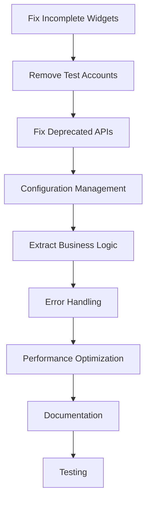

# Refactoring Plan

## Priority-Ordered Refactoring Recommendations

### Phase 1: Critical Issues (Immediate - Week 1-2)

#### 1. Fix Incomplete Widget Implementations (Critical)
**Priority**: Critical
**Files**: `lib/main.dart`, `lib/screens/auth/auth_wrapper.dart`, `lib/screens/auth/login_screen.dart`
**Risk**: High - App currently has broken UI components
**Effort**: 2-3 days

**Issue**: Multiple widgets have incomplete implementations with missing properties and empty containers.

**Steps**:
1. Complete FirebaseErrorScreen implementation in `lib/main.dart`
2. Fix auth wrapper loading and error screens
3. Implement missing form validation and UI elements

**Before**:
```dart
// Error icon
Container(
  ),
),
```

**After**:
```dart
// Error icon
Container(
  width: 80,
  height: 80,
  decoration: BoxDecoration(
    color: Colors.red.shade100,
    shape: BoxShape.circle,
  ),
  child: Icon(
    Icons.error_outline,
    size: 40,
    color: Colors.red.shade700,
  ),
),
```

#### 2. Remove Hardcoded Test Accounts (Critical)
**Priority**: Critical
**Files**: `lib/services/auth_service.dart`
**Risk**: High - Security vulnerability
**Effort**: 1 day

**Issue**: Hardcoded test accounts in production code pose security risks.

**Steps**:
1. Remove `_testAccounts` map
2. Remove `_useTestMode` flag
3. Implement proper Firebase authentication only
4. Create separate test environment configuration

#### 3. Fix Deprecated API Usage (High)
**Priority**: High
**Files**: `lib/main.dart`, theme files
**Risk**: Medium - Future Flutter compatibility issues
**Effort**: 1 day

**Issue**: Usage of deprecated `textScaleFactor` API.

**Before**:
```dart
textScaleFactor: MediaQuery.of(context).textScaleFactor.clamp(0.8, 1.2),
```

**After**:
```dart
textScaler: TextScaler.linear(
  MediaQuery.textScalerOf(context).scale(1.0).clamp(0.8, 1.2),
),
```

### Phase 2: Architecture Improvements (Week 3-4)

#### 4. Implement Configuration Management (High)
**Priority**: High
**Files**: `lib/config/development_config.dart` (currently empty)
**Risk**: Low
**Effort**: 3-4 days

**Steps**:
1. Create environment-specific configuration classes
2. Implement Firebase configuration per environment
3. Add feature flags system
4. Create build-time configuration injection

**Implementation**:
```dart
class AppConfig {
  static const String environment = String.fromEnvironment('ENV', defaultValue: 'development');
  
  static bool get isDevelopment => environment == 'development';
  static bool get isProduction => environment == 'production';
  
  static String get firebaseProjectId => isDevelopment 
    ? 'project-atlas-dev' 
    : 'project-atlas-prod';
}
```

#### 5. Extract Business Logic from UI (High)
**Priority**: High
**Files**: All screen files
**Risk**: Medium
**Effort**: 5-7 days

**Steps**:
1. Create dedicated controller/viewmodel classes
2. Move validation logic out of widgets
3. Extract form handling into separate classes
4. Implement proper separation of concerns

**Before**:
```dart
Future<void> _handleSignIn() async {
  if (!_formKey.currentState!.validate()) {
    return;
  }
  await ref.read(authProvider.notifier).signInWithEmail(
    email: _emailController.text.trim(),
    password: _passwordController.text,
  );
}
```

**After**:
```dart
class LoginController {
  Future<AuthResult> signIn(String email, String password) async {
    final validationResult = _validateCredentials(email, password);
    if (!validationResult.isValid) {
      return AuthResult.error(validationResult.error);
    }
    return await _authService.signInWithEmail(email, password);
  }
}
```

#### 6. Implement Proper Error Handling (High)
**Priority**: High
**Files**: All service and provider files
**Risk**: Medium
**Effort**: 4-5 days

**Steps**:
1. Create custom exception hierarchy
2. Implement error recovery mechanisms
3. Add user-friendly error messages
4. Implement retry logic for network operations

### Phase 3: Performance Optimizations (Week 5-6)

#### 7. Optimize Widget Rebuilds (Medium)
**Priority**: Medium
**Files**: All widget files
**Risk**: Low
**Effort**: 3-4 days

**Steps**:
1. Add const constructors where possible
2. Implement proper widget keys
3. Extract static widgets into separate classes
4. Use Consumer widgets strategically

#### 8. Implement Lazy Loading (Medium)
**Priority**: Medium
**Files**: Future list screens
**Risk**: Low
**Effort**: 2-3 days

**Steps**:
1. Implement pagination for data lists
2. Add lazy loading for images and content
3. Implement infinite scroll patterns

### Phase 4: Code Quality Improvements (Week 7-8)

#### 9. Add Comprehensive Documentation (Medium)
**Priority**: Medium
**Files**: All files
**Risk**: Low
**Effort**: 5-6 days

**Steps**:
1. Add dartdoc comments to all public APIs
2. Document complex business logic
3. Create usage examples for custom widgets
4. Add inline code comments for complex algorithms

#### 10. Implement Comprehensive Testing (Medium)
**Priority**: Medium
**Files**: `test/` directory
**Risk**: Low
**Effort**: 7-10 days

**Steps**:
1. Add unit tests for all services and providers
2. Create widget tests for custom components
3. Implement integration tests for user flows
4. Add golden tests for UI consistency

## Risk Assessment

### High Risk Refactoring
- **Removing test accounts**: Could break existing development workflows
- **Fixing incomplete widgets**: May reveal additional integration issues
- **Architecture changes**: Could introduce regressions if not properly tested

### Medium Risk Refactoring
- **Performance optimizations**: May change widget behavior
- **Error handling changes**: Could mask existing issues if not implemented correctly

### Low Risk Refactoring
- **Documentation additions**: No functional impact
- **Code formatting**: Automated and reversible

## Timeline and Effort Estimates

| Phase | Duration | Developer Days | Dependencies |
|-------|----------|----------------|--------------|
| Phase 1 | 2 weeks | 8-10 days | None |
| Phase 2 | 2 weeks | 12-15 days | Phase 1 complete |
| Phase 3 | 2 weeks | 8-10 days | Phase 2 complete |
| Phase 4 | 2 weeks | 12-16 days | Phase 3 complete |
| **Total** | **8 weeks** | **40-51 days** | Sequential |

## Dependencies Between Tasks



## Rollback Strategies

### For Each Phase

#### Phase 1 (Critical Issues)
- **Rollback Plan**: Keep original implementations in separate branches
- **Testing**: Smoke tests after each fix
- **Monitoring**: Check error rates and crash reports

#### Phase 2 (Architecture)
- **Rollback Plan**: Feature flags to toggle new architecture
- **Testing**: Comprehensive integration testing
- **Monitoring**: Performance metrics and user feedback

#### Phase 3 (Performance)
- **Rollback Plan**: Performance benchmarks before and after
- **Testing**: Load testing and memory profiling
- **Monitoring**: Frame rate and memory usage metrics

#### Phase 4 (Quality)
- **Rollback Plan**: Documentation and test additions are additive
- **Testing**: Test coverage reports
- **Monitoring**: Code quality metrics

## Success Metrics

### Phase 1 Success Criteria
- [ ] All widgets render without errors
- [ ] No hardcoded credentials in codebase
- [ ] Zero deprecated API warnings
- [ ] Successful Firebase authentication flow

### Phase 2 Success Criteria
- [ ] Environment-specific configurations working
- [ ] Business logic separated from UI components
- [ ] Proper error handling with user feedback
- [ ] Maintainable code architecture

### Phase 3 Success Criteria
- [ ] 60fps performance maintained
- [ ] Reduced memory usage by 20%
- [ ] Faster app startup time
- [ ] Smooth scrolling in all lists

### Phase 4 Success Criteria
- [ ] 90%+ code coverage
- [ ] All public APIs documented
- [ ] Zero critical lint warnings
- [ ] Automated quality gates passing

## Emergency Procedures

### If Critical Issues Arise
1. **Immediate Response**: Revert to last known good state
2. **Communication**: Notify stakeholders within 1 hour
3. **Investigation**: Root cause analysis within 4 hours
4. **Resolution**: Hotfix deployment within 8 hours
5. **Post-mortem**: Document lessons learned within 24 hours

### Hotfix Process
1. Create hotfix branch from production
2. Apply minimal fix with targeted testing
3. Deploy to staging for verification
4. Deploy to production with monitoring
5. Merge back to development branches

## Resource Allocation

### Recommended Team Structure
- **Senior Developer**: Architecture and critical issues (Phase 1-2)
- **Mid-level Developer**: Performance and quality improvements (Phase 3-4)
- **QA Engineer**: Testing strategy and implementation
- **DevOps Engineer**: Configuration and deployment setup

### Time Allocation by Role
- **Development**: 70% of total effort
- **Testing**: 20% of total effort
- **Documentation**: 10% of total effort

## Monitoring and Validation

### Key Performance Indicators
- **Code Quality**: Maintainability index, cyclomatic complexity
- **Performance**: Frame rate, memory usage, startup time
- **Reliability**: Crash rate, error rate, user retention
- **Maintainability**: Time to implement new features, bug fix time

### Continuous Monitoring
- Daily code quality reports
- Weekly performance benchmarks
- Monthly technical debt assessment
- Quarterly architecture review
