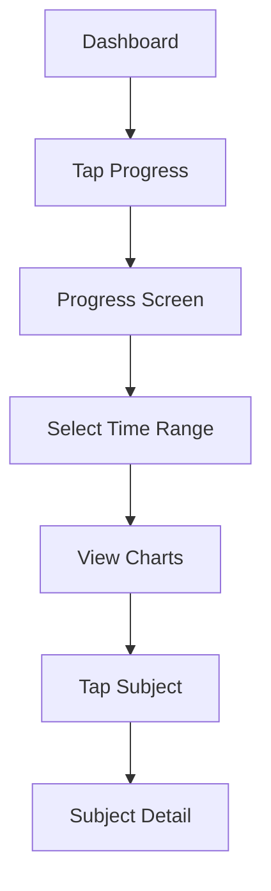

# UI-First Development Methodology - Project Atlas

## 🎨 PHILOSOPHY

**UI-First Development** prioritizes visual design and user experience before backend implementation. This approach ensures user needs drive technical decisions, not the other way around.

## 🌟 CORE PRINCIPLES

### 1. Visual Design First
- **Start with mockups** before writing code
- **Design user flows** before implementing logic  
- **Test interactions** before adding data
- **Polish animations** before optimizing performance

### 2. User Experience Driven
- Every feature starts with **"How will users interact with this?"**
- **Error states** and **loading states** designed upfront
- **Accessibility** considered from the beginning
- **Responsive design** built into every component

### 3. Iterative Refinement
- Build → Test → Refine → Repeat
- **Rapid prototyping** with mock data
- **Early user feedback** on visual design
- **Continuous improvement** based on usage patterns

## 📋 UI-FIRST DEVELOPMENT PROCESS

### Phase 1: Design & Mockup (Day 1)

#### Visual Design
```dart
// Start with static UI components using mock data
class ProgressScreen extends StatelessWidget {
  @override
  Widget build(BuildContext context) {
    // Mock data for design purposes
    final mockData = AnalyticsData.mock();
    
    return Scaffold(
      appBar: _buildAppBar(),
      body: Column(
        children: [
          _buildTimeRangeSelector(),
          _buildStudyTimeChart(mockData),
          _buildSubjectBreakdown(mockData),
          _buildStudyStreakCard(mockData),
        ],
      ),
    );
  }
}
```

#### User Flow Mapping


#### Interaction Design
- **Tap targets**: Minimum 44px for accessibility
- **Gestures**: Pull-to-refresh, swipe navigation
- **Feedback**: Haptics, animations, state changes
- **Loading**: Skeleton screens, progress indicators

### Phase 2: Component Development (Days 2-3)

#### Component Hierarchy
```dart
ProgressScreen
├── TimeRangeSelector
│   ├── RangeButton (Week/Month/Year)
│   └── CustomRangePicker
├── StudyTimeChart
│   ├── LineChart (fl_chart)
│   ├── ChartLegend
│   └── DataPoint tooltips
├── SubjectBreakdownCard
│   ├── DonutChart
│   ├── SubjectList
│   └── ExpandableDetails
└── StudyStreakWidget
    ├── StreakCounter
    ├── StreakCalendar
    └── StreakBadges
```

#### Component Implementation Strategy
```dart
// 1. Start with StatelessWidget and mock data
class StudyTimeChart extends StatelessWidget {
  final AnalyticsData data;
  
  @override
  Widget build(BuildContext context) {
    return Card(
      child: Padding(
        padding: EdgeInsets.all(16),
        child: Column(
          children: [
            _buildChartTitle(),
            _buildChart(data.studyTimePoints),
            _buildChartLegend(),
          ],
        ),
      ),
    );
  }
}

// 2. Add interactivity
class StudyTimeChart extends StatefulWidget {
  @override
  State<StudyTimeChart> createState() => _StudyTimeChartState();
}

// 3. Convert to ConsumerWidget when ready for real data
class StudyTimeChart extends ConsumerWidget {
  @override
  Widget build(BuildContext context, WidgetRef ref) {
    final analyticsData = ref.watch(analyticsProvider);
    // ...
  }
}
```

### Phase 3: State Integration (Day 4)

#### Data Layer Connection
```dart
// Connect UI to data providers
@riverpod
Future<AnalyticsData> analyticsData(AnalyticsDataRef ref, TimeRange range) async {
  final repository = ref.read(dashboardRepositoryProvider);
  return repository.getAnalytics(range);
}

// Handle loading and error states in UI
Widget build(BuildContext context, WidgetRef ref) {
  final analyticsAsync = ref.watch(analyticsDataProvider(selectedRange));
  
  return analyticsAsync.when(
    data: (data) => _buildChartWithData(data),
    loading: () => _buildLoadingSkeleton(),
    error: (error, stack) => _buildErrorState(error),
  );
}
```

#### State Management Integration
```dart
// Add state management for UI interactions
@riverpod
class SelectedTimeRange extends _$SelectedTimeRange {
  @override
  TimeRange build() => TimeRange.week;
  
  void selectRange(TimeRange range) {
    state = range;
  }
}

// Connect UI interactions to state
void _onRangeSelected(TimeRange range) {
  ref.read(selectedTimeRangeProvider.notifier).selectRange(range);
}
```

### Phase 4: Polish & Testing (Day 5)

#### Animation Implementation
```dart
class StudyTimeChart extends StatefulWidget {
  @override
  State<StudyTimeChart> createState() => _StudyTimeChartState();
}

class _StudyTimeChartState extends State<StudyTimeChart>
    with SingleTickerProviderStateMixin {
  late AnimationController _animationController;
  late Animation<double> _fadeAnimation;
  
  @override
  void initState() {
    super.initState();
    _animationController = AnimationController(
      duration: Duration(milliseconds: 800),
      vsync: this,
    );
    _fadeAnimation = Tween<double>(begin: 0.0, end: 1.0).animate(
      CurvedAnimation(parent: _animationController, curve: Curves.easeInOut),
    );
    _animationController.forward();
  }
  
  @override
  Widget build(BuildContext context) {
    return FadeTransition(
      opacity: _fadeAnimation,
      child: _buildChart(),
    );
  }
}
```

#### Accessibility Implementation
```dart
Widget _buildChart() {
  return Semantics(
    label: 'Study time chart showing ${_getDataSummary()}',
    child: ExcludeSemantics(
      child: LineChart(
        LineChartData(
          // Chart configuration
        ),
      ),
    ),
  );
}
```

## 🎨 TRAVELER'S DIARY DESIGN SYSTEM

### Color Usage Guidelines

#### Primary Colors
```dart
// Use primary colors for main actions and headers
AppColors.primaryBrown   // Headers, main buttons
AppColors.primaryGold    // Accent, highlights, FABs
AppColors.parchmentWhite // Backgrounds, cards
```

#### Semantic Colors
```dart
// Use semantic colors for specific meanings
AppColors.treasureGreen  // Success, completion, achievements
AppColors.compassRed     // Errors, warnings, critical actions
AppColors.skyBlue        // Information, links, secondary actions
```

#### Neutral Colors
```dart
// Use neutrals for text and subtle elements
AppColors.inkBlack       // Primary text, dark text
AppColors.fadeGray       // Secondary text, disabled states
AppColors.textSecondary  // Captions, metadata
```

### Typography Guidelines

#### Headings (Caveat Font)
```dart
// Use for titles, headings, decorative text
style: Theme.of(context).textTheme.headlineLarge?.copyWith(
  fontFamily: 'Caveat',
  color: AppColors.primaryBrown,
  fontWeight: FontWeight.w600,
)
```

#### Body Text (Nunito Sans)
```dart
// Use for readable content, descriptions
style: Theme.of(context).textTheme.bodyLarge?.copyWith(
  color: AppColors.inkBlack,
  height: 1.5, // Better readability
)
```

#### Captions and Metadata
```dart
// Use for less important information
style: Theme.of(context).textTheme.bodySmall?.copyWith(
  color: AppColors.fadeGray,
  fontSize: 12,
)
```

### Layout Guidelines

#### Card Design
```dart
// Standard card styling for consistency
Card(
  elevation: 2,
  shape: RoundedRectangleBorder(
    borderRadius: BorderRadius.circular(12),
  ),
  color: AppColors.parchmentWhite,
  child: Padding(
    padding: EdgeInsets.all(16),
    child: content,
  ),
)
```

#### Spacing System
```dart
// Use consistent spacing throughout
const spacing = 8.0;  // Base unit

// Common spacings
SizedBox(height: spacing),      // 8px
SizedBox(height: spacing * 2),  // 16px  
SizedBox(height: spacing * 3),  // 24px
SizedBox(height: spacing * 4),  // 32px
```

### Animation Guidelines

#### Page Transitions
```dart
// Use slide transitions for navigation
PageRouteBuilder(
  pageBuilder: (context, animation, secondaryAnimation) => NewScreen(),
  transitionsBuilder: (context, animation, secondaryAnimation, child) {
    return SlideTransition(
      position: animation.drive(
        Tween(begin: Offset(1.0, 0.0), end: Offset.zero)
            .chain(CurveTween(curve: Curves.easeInOut)),
      ),
      child: child,
    );
  },
)
```

#### Loading Animations
```dart
// Use fade-in for content appearance
FadeTransition(
  opacity: CurvedAnimation(
    parent: animationController,
    curve: Curves.easeIn,
  ),
  child: content,
)
```

## 📱 RESPONSIVE DESIGN PRINCIPLES

### Breakpoints
```dart
class Breakpoints {
  static const double mobile = 600;
  static const double tablet = 900;
  static const double desktop = 1200;
}

// Usage
Widget _buildResponsiveLayout(BuildContext context) {
  final screenWidth = MediaQuery.of(context).size.width;
  
  if (screenWidth < Breakpoints.mobile) {
    return _buildMobileLayout();
  } else if (screenWidth < Breakpoints.tablet) {
    return _buildTabletLayout();
  } else {
    return _buildDesktopLayout();
  }
}
```

### Flexible Layouts
```dart
// Use Flex widgets for responsive designs
Row(
  children: [
    Expanded(flex: 2, child: chart),
    SizedBox(width: 16),
    Expanded(flex: 1, child: summary),
  ],
)

// Use LayoutBuilder for complex responsive behavior
LayoutBuilder(
  builder: (context, constraints) {
    if (constraints.maxWidth > 600) {
      return _buildWideLayout();
    } else {
      return _buildNarrowLayout();
    }
  },
)
```

## 🧪 UI TESTING STRATEGY

### Widget Tests
```dart
// Test UI components in isolation
testWidgets('StudyTimeChart displays correctly', (tester) async {
  final mockData = AnalyticsData.mock();
  
  await tester.pumpWidget(
    MaterialApp(
      home: StudyTimeChart(data: mockData),
    ),
  );
  
  // Verify UI elements exist
  expect(find.byType(LineChart), findsOneWidget);
  expect(find.text('Study Time'), findsOneWidget);
  
  // Test interactions
  await tester.tap(find.text('Week'));
  await tester.pump();
  
  // Verify state changes
  expect(find.text('Weekly View'), findsOneWidget);
});
```

### Golden Tests
```dart
// Test visual regression
testWidgets('ProgressScreen golden test', (tester) async {
  await tester.pumpWidget(
    MaterialApp(home: ProgressScreen()),
  );
  
  await tester.pumpAndSettle();
  
  await expectLater(
    find.byType(ProgressScreen),
    matchesGoldenFile('progress_screen.png'),
  );
});
```

### Accessibility Tests
```dart
// Test accessibility features
testWidgets('ProgressScreen accessibility', (tester) async {
  await tester.pumpWidget(
    MaterialApp(home: ProgressScreen()),
  );
  
  // Check semantic labels
  expect(
    tester.getSemantics(find.byType(StudyTimeChart)),
    matchesSemantics(label: contains('Study time chart')),
  );
  
  // Check focus order
  await tester.sendKeyEvent(LogicalKeyboardKey.tab);
  // Verify focus moves correctly
});
```

## 🎯 QUALITY METRICS

### UI Quality Checklist
- [ ] **Visual consistency** - Uses design system colors and typography
- [ ] **Responsive design** - Works on mobile, tablet, desktop
- [ ] **Accessibility** - Screen reader support, keyboard navigation
- [ ] **Performance** - Smooth animations, fast rendering
- [ ] **Error handling** - Graceful error states, retry mechanisms
- [ ] **Loading states** - Skeleton screens, progress indicators

### User Experience Metrics
- [ ] **Task completion rate** - Users can complete intended actions
- [ ] **Time to value** - Users see meaningful content quickly
- [ ] **Error recovery** - Users can recover from errors easily
- [ ] **Learnability** - New users understand the interface
- [ ] **Satisfaction** - Users enjoy using the interface

This UI-first methodology ensures that Project Atlas delivers exceptional user experiences while maintaining technical excellence. By starting with design and user needs, we create features that users actually want to use, not just features that work.
